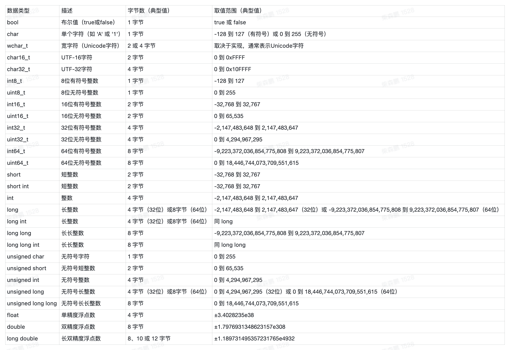

# 数据结构

- 数据结构的职责就是增删查改，再无其他。

## 数组
### 静态数组
- 「静态数组」就是一块连续的内存空间，我们可以通过索引来访问这块内存空间中的元素，这才是数组的原始形态。

```C++
// 定义一个大小为 10 的静态数组
int arr[10];
// 1、在内存中开辟了一段连续的内存空间，大小是 10 * sizeof(int) 字节。一个 int 在计算机内存中占 4 字节，也就是总共 40 字节。
// 2、定义了一个名为 arr 的数组指针，指向这段内存空间的首地址。

// 用 memset 函数把数组的值初始化为 0
memset(arr, 0, sizeof(arr));

// 使用索引赋值
arr[0] = 1;
arr[1] = 2;
// 1、计算 arr 的首地址加上 1 * sizeof(int) 字节（4 字节）的偏移量，找到了内存空间中的第二个元素的首地址。
// 2、从这个地址开始的 4 个字节的内存空间中写入了整数 2。

// 使用索引取值
int a = arr[0];
```

- 数组的插入
- 对于指定索引插入，直接赋值即可，时间复杂度为 O(1)
- 对于中间插入，需要将插入位置后的元素后移，时间复杂度为 O(n)

- 数组的删除
- 对于指定索引删除，直接赋值为默认值即可，时间复杂度为 O(1)

综上，静态数组的增删查改操作的时间复杂度是：

- 增：
  - 在末尾追加元素：O(1)。
  - 在中间（非末尾）插入元素：O(N)。
- 删：
  - 删除末尾元素：O(1)。
  - 删除中间（非末尾）元素：O(N)。
- 查：给定指定索引，查询索引对应的元素的值，时间复杂度 O(1)。
- 改：给定指定索引，修改索引对应的元素的值，时间复杂度 O(1)。



### 动态数组

C++常用函数
```C++
// 创建动态数组
// 不用显式指定数组大小，它会根据实际存储的元素数量自动扩缩容
vector<int> arr;

for (int i = 0; i < 10; i++) {
    // 在末尾追加元素，时间复杂度 O(1)
    arr.push_back(i);
}

// 在中间插入元素，时间复杂度 O(N)
// 在索引 2 的位置插入元素 666
arr.insert(arr.begin() + 2, 666);

// 在头部插入元素，时间复杂度 O(N)
arr.insert(arr.begin(), -1);

// 删除末尾元素，时间复杂度 O(1)
arr.pop_back();

// 删除中间元素，时间复杂度 O(N)
// 删除索引 2 的元素
arr.erase(arr.begin() + 2);

// 根据索引查询元素，时间复杂度 O(1)
int a = arr[0];

// 根据索引修改元素，时间复杂度 O(1)
arr[0] = 100;

// 根据元素值查找索引，时间复杂度 O(N)
int index = find(arr.begin(), arr.end(), 666) - arr.begin();
```

## 链表
- 常见 LeetCode 单链表
```C++
class ListNode {
    public:
        int val;
        ListNode *next; 
        ListNode(int x) : val(x), next(NULL) {}
};
```
- 基于数组创建的单链表
```C++
class ListNode {
public:
    int val;
    ListNode *next;
    ListNode(int x) : val(x), next(NULL) {}
};

// 输入一个数组，转换为一条单链表
ListNode* createLinkedList(std::vector<int> arr) {
    if (arr.empty()) {
        return nullptr;
    }
    ListNode* head = new ListNode(arr[0]);
    ListNode* cur = head;
    for (int i = 1; i < arr.size(); i++) {
        cur->next = new ListNode(arr[i]);
        cur = cur->next;
    }
    return head;
}
```
- 基于数组创建的双链表
```C++
class DoublyListNode {
public:
    int val;
    DoublyListNode *next, *prev;
    DoublyListNode(int x) : val(x), next(NULL), prev(NULL) {}
};

DoublyListNode* createDoublyLinkedList(vector<int>& arr) {
    if (arr.empty()) {
        return NULL;
    }
    DoublyListNode* head = new DoublyListNode(arr[0]);
    DoublyListNode* cur = head;
    // for 循环迭代创建双链表
    for (int i = 1; i < arr.size(); i++) {
        DoublyListNode* newNode = new DoublyListNode(arr[i]);
        cur->next = newNode;
        newNode->prev = cur;
        cur = cur->next;
    }
    return head;
}
```

## 环形数组
- 环形数组技巧利用求模（余数）运算，将普通数组变成逻辑上的环形数组，可以让我们用 O(1) 的时间在数组头部增删元素。
- 环形数组的关键在于，它维护了两个指针 start 和 end，start 指向第一个有效元素的索引，end 指向最后一个有效元素的下一个位置索引。
- 这样，当我们在数组头部添加或删除元素时，只需要移动 start 索引，而在数组尾部添加或删除元素时，只需要移动 end 索引。
- 当 start, end 移动超出数组边界（< 0 或 >= arr.length）时，我们可以通过求模运算 % 让它们转一圈到数组头部或尾部继续工作，这样就实现了环形数组的效果。

代码实现
- 这里的关键在于需要理解左闭右开的概念
    - 因为这样初始化 start = end = 0 时，区间 [0, 0) 中没有元素，但只要让 end 向右移动（扩大）一位，区间 [0, 1) 就包含一个元素 0 了。
- 注意环形数组的取值每次都会计算 %，因此效率上是比较低的
```C++
#include <iostream>
#include <stdexcept>
#include <ostream>

template<typename T>
class CycleArray {
    std::unique_ptr<T[]> arr;
    int start;
    int end;
    int count;
    int size;

    // 自动扩缩容辅助函数
    void resize(int newSize) {
        // 创建新的数组
        std::unique_ptr<T[]> newArr = std::make_unique<T[]>(newSize);
        // 将旧数组的元素复制到新数组中
        for (int i = 0; i < count; ++i) {
            newArr[i] = arr[(start + i) % size];
        }
        arr = std::move(newArr);
        // 重置 start 和 end 指针
        start = 0;
        end = count;
        size = newSize;
    }

public:
    CycleArray() : CycleArray(1) {
    }

    explicit CycleArray(int size) : start(0), end(0), count(0), size(size) {
        arr = std::make_unique<T[]>(size);
    }

    // 在数组头部添加元素，时间复杂度 O(1)
    void addFirst(const T &val) {
        // 当数组满时，扩容为原来的两倍
        if (isFull()) {
            resize(size * 2);
        }
        // 因为 start 是闭区间，所以先左移，再赋值
        start = (start - 1 + size) % size;
        arr[start] = val;
        count++;
    }

    // 删除数组头部元素，时间复杂度 O(1)
    void removeFirst() {
        if (isEmpty()) {
            throw std::runtime_error("Array is empty");
        }
        // 因为 start 是闭区间，所以先赋值，再右移
        arr[start] = T();
        start = (start + 1) % size;
        count--;
        // 如果数组元素数量减少到原大小的四分之一，则减小数组大小为一半
        if (count > 0 && count == size / 4) {
            resize(size / 2);
        }
    }

    // 在数组尾部添加元素，时间复杂度 O(1)
    void addLast(const T &val) {
        if (isFull()) {
            resize(size * 2);
        }
        // 因为 end 是开区间，所以是先赋值，再右移
        arr[end] = val;
        end = (end + 1) % size;
        count++;
    }

    // 删除数组尾部元素，时间复杂度 O(1)
    void removeLast() {
        if (isEmpty()) {
            throw std::runtime_error("Array is empty");
        }
        // 因为 end 是开区间，所以先左移，再赋值
        end = (end - 1 + size) % size;
        arr[end] = T();
        count--;
        // 缩容
        if (count > 0 && count == size / 4) {
            resize(size / 2);
        }
    }

    // 获取数组头部元素，时间复杂度 O(1)
    T getFirst() const {
        if (isEmpty()) {
            throw std::runtime_error("Array is empty");
        }
        return arr[start];
    }

    // 获取数组尾部元素，时间复杂度 O(1)
    T getLast() const {
        if (isEmpty()) {
            throw std::runtime_error("Array is empty");
        }
        // end 是开区间，指向的是下一个元素的位置，所以要减 1
        return arr[(end - 1 + size) % size];
    }

    bool isFull() const {
        return count == size;
    }

    int getSize() const {
        return count;
    }

    bool isEmpty() const {
        return count == 0;
    }
};
```


## 哈希表
- 哈希表的本质是一个数组，数组中每个元素是一个哈希桶，哈希桶中存储的是键值对。
- 注意，不要混淆哈希表和 Map，Map 只是一个接口 Interface，底层有不同的实现方式
- 你可以说 HashMap 的 get, put, remove 方法的复杂度都是 O(1) 的，但你不能说 Map 接口的复杂度都是 O(1)。因为如果换成其他的实现类，比如底层用二叉树结构实现的 TreeMap，这些方法的复杂度就变成 O(logN) 了。

### 最基础的哈希表实现
- hash 函数的时间复杂度必须是 O(1)，才能保证上述方法的复杂度都是 O(1)
- hash 函数内部，首先确保相同的 key 返回相同的 hash 值，但是不同的 key 返回不同的 hash 值，这里就是 hash 冲突
    - 解决 hash 冲突的方法有：
        - 开放寻址法
        - 链表法
        - 红黑树法
        - 跳表法
        - 分段寻址法
    - hash 冲突的本质原因：
        1、哈希函数设计的不好，导致 key 的哈希值分布不均匀，很多 key 映射到了同一个索引上。
        2、哈希表里面已经装了太多的 key-value 对了，这种情况下即使哈希函数再完美，也没办法避免哈希冲突。
- key 必须是不可变的，只有那些不可变类型，才能作为哈希表的 key，这一点很重要。
    - 如果 key 是个 list，由于计算 hash 时会遍历 list 来计算，一方面计算的时间复杂度会增加，另一方面 list 出现变化，其 hash 也会变化，可能会导致内存泄露
``` C++
// 哈希表伪码逻辑
class MyHashMap {

private:
    vector<void*> table;

public:
    // 增/改，复杂度 O(1)
    void put(auto key, auto value) {
        int index = hash(key);
        table[index] = value;
    }

    // 查，复杂度 O(1)
    auto get(auto key) {
        int index = hash(key);
        return table[index];
    }

    // 删，复杂度 O(1)
    void remove(auto key) {
        int index = hash(key);
        table[index] = nullptr;
    }

private:
    // 哈希函数，把 key 转化成 table 中的合法索引
    // 时间复杂度必须是 O(1)，才能保证上述方法的复杂度都是 O(1)
    int hash(auto key) {
        // ...
    }
};
```
### 1. 哈希表的拉链法（Separate Chaining）

#### 思路介绍

拉链法（也称"链地址法"）的基本思想是：

- 用一个数组作为哈希表，每个数组元素存放一个链表（或其他容器），所有映射到同一索引的键会放到对应链表中
- 插入时，根据哈希函数计算索引，再将元素插入到对应链表中
- 查询和删除时，同样先通过哈希函数定位到链表，然后遍历链表查找目标键

优缺点：
- 优点：简单易实现，不依赖于额外的重排操作
- 缺点：
  - 额外的指针空间开销
  - 链表查找在最坏情况下性能可能退化为 O(n)
```C++
#include <vector>
#include <list>
#include <string>
#include <stdexcept>
#include <functional>
using namespace std;

class MyHashMap {
private:
    vector<list<pair<string, int>>> table;
    int capacity;

    // 使用 std::hash 对字符串计算 hash 值，计算桶下标
    int hashFunc(const string& key) const {
        return std::hash<string>{}(key) % capacity;
    }

public:
    MyHashMap(int size) : capacity(size) {
        if (size <= 0) {
            throw std::invalid_argument("容量必须大于零");
        }
        table.resize(capacity);
    }

    // 添加或更新键值对。遍历桶一次，若存在则更新，否则插入新的元素
    void put(const string& key, int value) {
        int index = hashFunc(key);
        // 单次遍历桶，查找是否已有相同 key
        for (auto it = table[index].begin(); it != table[index].end(); ++it) {
            if (it->first == key) {
                it->second = value;
                return;
            }
        }
        // 未找到则在桶尾插入
        table[index].push_back({key, value});
    }

    // 查找键对应的值。单次遍历桶；若查到则将值存入 value 并返回 true，否则返回 false。
    bool get(const string& key, int &value) const {
        int index = hashFunc(key);
        for (const auto &kv : table[index]) {
            if (kv.first == key) {
                value = kv.second;
                return true;
            }
        }
        return false;
    }

    // 删除指定键。单次遍历桶找到匹配元素后直接使用迭代器删除
    void remove(const string& key) {
        int index = hashFunc(key);
        auto it = table[index].begin();
        while (it != table[index].end()) {
            if (it->first == key) {
                table[index].erase(it);
                return;
            }
            ++it;
        }
    }

    // 检查是否包含指定的 key
    bool contains(const string& key) const {
        int index = hashFunc(key);
        for (const auto &kv : table[index]) {
            if (kv.first == key)
                return true;
        }
        return false;
    }
};
```

### 2. 哈希表的开放寻址法（Open Addressing）
- 这里的关键是需要记录当前的一个状态，然后根据这个状态来决定如何进行插入、删除、查找
- 这里的状态有三种：
    - 空闲
    - 已删除 很关键，避免影响查找的逻辑
    - 已插入
- 因此，需要一个额外的状态数组来记录当前的状态

```C++
#include <vector>
#include <string>
#include <stdexcept>
#include <functional>
using namespace std;

enum Status {
    EMPTY,
    DELETED,
    OCCUPIED
};

struct Entry {
    string key;
    double value;
    Status status;
    Entry(string k, double v, Status s) : key(""), value(0), status(EMPTY) {}
};

class MyHashMap {
private:
    vector<Entry> table;
    int capacity;

    // 哈希函数，计算键的哈希值
    int hashFunc(const string& key) const {
        return std::hash<string>{}(key) % capacity;
    }

public:
    MyHashMap(int size) : capacity(size) {
        if (size <= 0) {
            throw std::invalid_argument("容量必须大于零");
        }
        table.resize(capacity);
    }

    // 添加或更新键值对
    void put(const string& key, double value) {
        int index = hashFunc(key);
        int start = index;
        // 遍历桶，找到空闲位置或相同 key 的位置
        // 如果找到相同 key 的位置，则更新 value
        // 如果没找到相同的 key，就找第一个非 OCCUPIED 的位置
        while (table[index].status == OCCUPIED) {
            if (table[index].key == key) {
                table[index].value = value;
                return;
            }
            index = (index + 1) % capacity;
            if (index == start) {
                throw std::runtime_error("哈希表已满");
            }
        }
        // 插入新键值对
        table[index] = Entry(key, value, OCCUPIED);
    }

    // 查找键值对,从第一个 index 开始找，直到第一个 EMPTY 的位置
    bool get(const string& key, double &value) {
        int index = hashFunc(key);
        int start = index;
        while (table[index].status != EMPTY) {
            if (table[index].key == key && table[index].status == OCCUPIED) {
                value = table[index].value;
                return true;
            }
            index = (index + 1) % capacity;
            if (index == start) {
                return false;
            }
        }
        return false;
    }

    // 删除键值对
    void remove(const string& key) {
        int index = hashFunc(key);
        int start = index;
        while (table[index].status != EMPTY) {
            if (table[index].key == key && table[index].status == OCCUPIED) {
                table[index].status = DELETED;
                return;
            }
            index = (index + 1) % capacity;
            if (index == start) {
                throw std::runtime_error("键值对不存在");
            }
        }
    }

    bool contains(const string& key) {
        double dummyValue;
        return get(key, dummyValue);
    }
};

```