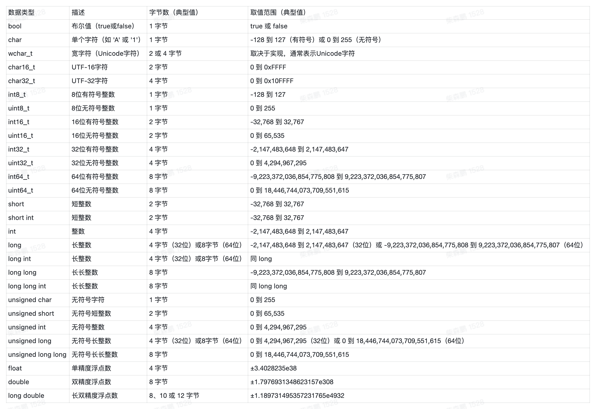
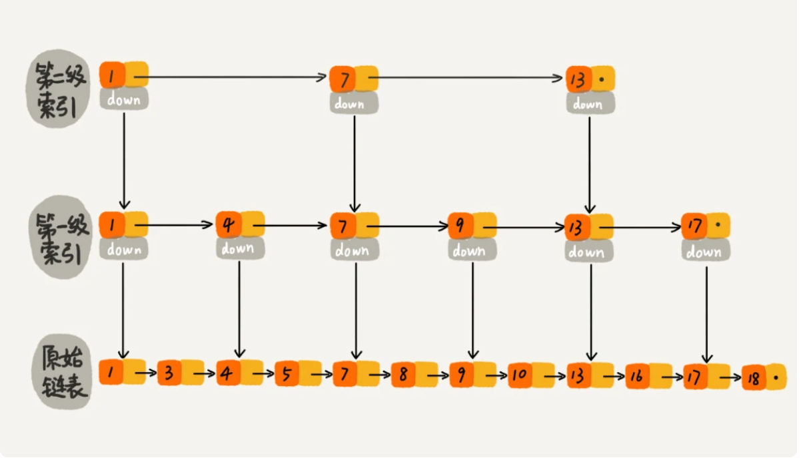

# 数据结构

- 数据结构的职责就是增删查改，再无其他。

## 数组
### 静态数组
- 「静态数组」就是一块连续的内存空间，我们可以通过索引来访问这块内存空间中的元素，这才是数组的原始形态。

```C++
// 定义一个大小为 10 的静态数组
int arr[10];
// 1、在内存中开辟了一段连续的内存空间，大小是 10 * sizeof(int) 字节。一个 int 在计算机内存中占 4 字节，也就是总共 40 字节。
// 2、定义了一个名为 arr 的数组指针，指向这段内存空间的首地址。

// 用 memset 函数把数组的值初始化为 0
memset(arr, 0, sizeof(arr));

// 使用索引赋值
arr[0] = 1;
arr[1] = 2;
// 1、计算 arr 的首地址加上 1 * sizeof(int) 字节（4 字节）的偏移量，找到了内存空间中的第二个元素的首地址。
// 2、从这个地址开始的 4 个字节的内存空间中写入了整数 2。

// 使用索引取值
int a = arr[0];
```

- 数组的插入
- 对于指定索引插入，直接赋值即可，时间复杂度为 O(1)
- 对于中间插入，需要将插入位置后的元素后移，时间复杂度为 O(n)

- 数组的删除
- 对于指定索引删除，直接赋值为默认值即可，时间复杂度为 O(1)

综上，静态数组的增删查改操作的时间复杂度是：

- 增：
  - 在末尾追加元素：O(1)。
  - 在中间（非末尾）插入元素：O(N)。
- 删：
  - 删除末尾元素：O(1)。
  - 删除中间（非末尾）元素：O(N)。
- 查：给定指定索引，查询索引对应的元素的值，时间复杂度 O(1)。
- 改：给定指定索引，修改索引对应的元素的值，时间复杂度 O(1)。



### 动态数组

C++常用函数
```C++
// 创建动态数组
// 不用显式指定数组大小，它会根据实际存储的元素数量自动扩缩容
vector<int> arr;

for (int i = 0; i < 10; i++) {
    // 在末尾追加元素，时间复杂度 O(1)
    arr.push_back(i);
}

// 在中间插入元素，时间复杂度 O(N)
// 在索引 2 的位置插入元素 666
arr.insert(arr.begin() + 2, 666);

// 在头部插入元素，时间复杂度 O(N)
arr.insert(arr.begin(), -1);

// 删除末尾元素，时间复杂度 O(1)
arr.pop_back();

// 删除中间元素，时间复杂度 O(N)
// 删除索引 2 的元素
arr.erase(arr.begin() + 2);

// 根据索引查询元素，时间复杂度 O(1)
int a = arr[0];

// 根据索引修改元素，时间复杂度 O(1)
arr[0] = 100;

// 根据元素值查找索引，时间复杂度 O(N)
int index = find(arr.begin(), arr.end(), 666) - arr.begin();
```

## 链表
- 常见 LeetCode 单链表
```C++
class ListNode {
    public:
        int val;
        ListNode *next; 
        ListNode(int x) : val(x), next(NULL) {}
};
```
- 基于数组创建的单链表
```C++
class ListNode {
public:
    int val;
    ListNode *next;
    ListNode(int x) : val(x), next(NULL) {}
};

// 输入一个数组，转换为一条单链表
ListNode* createLinkedList(std::vector<int> arr) {
    if (arr.empty()) {
        return nullptr;
    }
    ListNode* head = new ListNode(arr[0]);
    ListNode* cur = head;
    for (int i = 1; i < arr.size(); i++) {
        cur->next = new ListNode(arr[i]);
        cur = cur->next;
    }
    return head;
}
```
- 基于数组创建的双链表
```C++
class DoublyListNode {
public:
    int val;
    DoublyListNode *next, *prev;
    DoublyListNode(int x) : val(x), next(NULL), prev(NULL) {}
};

DoublyListNode* createDoublyLinkedList(vector<int>& arr) {
    if (arr.empty()) {
        return NULL;
    }
    DoublyListNode* head = new DoublyListNode(arr[0]);
    DoublyListNode* cur = head;
    // for 循环迭代创建双链表
    for (int i = 1; i < arr.size(); i++) {
        DoublyListNode* newNode = new DoublyListNode(arr[i]);
        cur->next = newNode;
        newNode->prev = cur;
        cur = cur->next;
    }
    return head;
}
```

## 环形数组
- 环形数组技巧利用求模（余数）运算，将普通数组变成逻辑上的环形数组，可以让我们用 O(1) 的时间在数组头部增删元素。
- 环形数组的关键在于，它维护了两个指针 start 和 end，start 指向第一个有效元素的索引，end 指向最后一个有效元素的下一个位置索引。
- 这样，当我们在数组头部添加或删除元素时，只需要移动 start 索引，而在数组尾部添加或删除元素时，只需要移动 end 索引。
- 当 start, end 移动超出数组边界（< 0 或 >= arr.length）时，我们可以通过求模运算 % 让它们转一圈到数组头部或尾部继续工作，这样就实现了环形数组的效果。

代码实现
- 这里的关键在于需要理解左闭右开的概念
    - 因为这样初始化 start = end = 0 时，区间 [0, 0) 中没有元素，但只要让 end 向右移动（扩大）一位，区间 [0, 1) 就包含一个元素 0 了。
- 注意环形数组的取值每次都会计算 %，因此效率上是比较低的
```C++
#include <iostream>
#include <stdexcept>
#include <ostream>

template<typename T>
class CycleArray {
    std::unique_ptr<T[]> arr;
    int start;
    int end;
    int count;
    int size;

    // 自动扩缩容辅助函数
    void resize(int newSize) {
        // 创建新的数组
        std::unique_ptr<T[]> newArr = std::make_unique<T[]>(newSize);
        // 将旧数组的元素复制到新数组中
        for (int i = 0; i < count; ++i) {
            newArr[i] = arr[(start + i) % size];
        }
        arr = std::move(newArr);
        // 重置 start 和 end 指针
        start = 0;
        end = count;
        size = newSize;
    }

public:
    CycleArray() : CycleArray(1) {
    }

    explicit CycleArray(int size) : start(0), end(0), count(0), size(size) {
        arr = std::make_unique<T[]>(size);
    }

    // 在数组头部添加元素，时间复杂度 O(1)
    void addFirst(const T &val) {
        // 当数组满时，扩容为原来的两倍
        if (isFull()) {
            resize(size * 2);
        }
        // 因为 start 是闭区间，所以先左移，再赋值
        start = (start - 1 + size) % size;
        arr[start] = val;
        count++;
    }

    // 删除数组头部元素，时间复杂度 O(1)
    void removeFirst() {
        if (isEmpty()) {
            throw std::runtime_error("Array is empty");
        }
        // 因为 start 是闭区间，所以先赋值，再右移
        arr[start] = T();
        start = (start + 1) % size;
        count--;
        // 如果数组元素数量减少到原大小的四分之一，则减小数组大小为一半
        if (count > 0 && count == size / 4) {
            resize(size / 2);
        }
    }

    // 在数组尾部添加元素，时间复杂度 O(1)
    void addLast(const T &val) {
        if (isFull()) {
            resize(size * 2);
        }
        // 因为 end 是开区间，所以是先赋值，再右移
        arr[end] = val;
        end = (end + 1) % size;
        count++;
    }

    // 删除数组尾部元素，时间复杂度 O(1)
    void removeLast() {
        if (isEmpty()) {
            throw std::runtime_error("Array is empty");
        }
        // 因为 end 是开区间，所以先左移，再赋值
        end = (end - 1 + size) % size;
        arr[end] = T();
        count--;
        // 缩容
        if (count > 0 && count == size / 4) {
            resize(size / 2);
        }
    }

    // 获取数组头部元素，时间复杂度 O(1)
    T getFirst() const {
        if (isEmpty()) {
            throw std::runtime_error("Array is empty");
        }
        return arr[start];
    }

    // 获取数组尾部元素，时间复杂度 O(1)
    T getLast() const {
        if (isEmpty()) {
            throw std::runtime_error("Array is empty");
        }
        // end 是开区间，指向的是下一个元素的位置，所以要减 1
        return arr[(end - 1 + size) % size];
    }

    bool isFull() const {
        return count == size;
    }

    int getSize() const {
        return count;
    }

    bool isEmpty() const {
        return count == 0;
    }
};
```


## 哈希表
- 哈希表的本质是一个数组，数组中每个元素是一个哈希桶，哈希桶中存储的是键值对。
- 注意，不要混淆哈希表和 Map，Map 只是一个接口 Interface，底层有不同的实现方式
- 你可以说 HashMap 的 get, put, remove 方法的复杂度都是 O(1) 的，但你不能说 Map 接口的复杂度都是 O(1)。因为如果换成其他的实现类，比如底层用二叉树结构实现的 TreeMap，这些方法的复杂度就变成 O(logN) 了。

### 最基础的哈希表实现
- hash 函数的时间复杂度必须是 O(1)，才能保证上述方法的复杂度都是 O(1)
- hash 函数内部，首先确保相同的 key 返回相同的 hash 值，但是不同的 key 返回不同的 hash 值，这里就是 hash 冲突
    - 解决 hash 冲突的方法有：
        - 开放寻址法
        - 链表法
        - 红黑树法
        - 跳表法
        - 分段寻址法
    - hash 冲突的本质原因：
        1、哈希函数设计的不好，导致 key 的哈希值分布不均匀，很多 key 映射到了同一个索引上。
        2、哈希表里面已经装了太多的 key-value 对了，这种情况下即使哈希函数再完美，也没办法避免哈希冲突。
- key 必须是不可变的，只有那些不可变类型，才能作为哈希表的 key，这一点很重要。
    - 如果 key 是个 list，由于计算 hash 时会遍历 list 来计算，一方面计算的时间复杂度会增加，另一方面 list 出现变化，其 hash 也会变化，可能会导致内存泄露
``` C++
// 哈希表伪码逻辑
class MyHashMap {

private:
    vector<void*> table;

public:
    // 增/改，复杂度 O(1)
    void put(auto key, auto value) {
        int index = hash(key);
        table[index] = value;
    }

    // 查，复杂度 O(1)
    auto get(auto key) {
        int index = hash(key);
        return table[index];
    }

    // 删，复杂度 O(1)
    void remove(auto key) {
        int index = hash(key);
        table[index] = nullptr;
    }

private:
    // 哈希函数，把 key 转化成 table 中的合法索引
    // 时间复杂度必须是 O(1)，才能保证上述方法的复杂度都是 O(1)
    int hash(auto key) {
        // ...
    }
};
```
### 1. 哈希表的拉链法（Separate Chaining）

#### 思路介绍

拉链法（也称"链地址法"）的基本思想是：

- 用一个数组作为哈希表，每个数组元素存放一个链表（或其他容器），所有映射到同一索引的键会放到对应链表中
- 插入时，根据哈希函数计算索引，再将元素插入到对应链表中
- 查询和删除时，同样先通过哈希函数定位到链表，然后遍历链表查找目标键

优缺点：
- 优点：简单易实现，不依赖于额外的重排操作
- 缺点：
  - 额外的指针空间开销
  - 链表查找在最坏情况下性能可能退化为 O(n)
```C++
#include <vector>
#include <list>
#include <string>
#include <stdexcept>
#include <functional>
using namespace std;

class MyHashMap {
private:
    vector<list<pair<string, int>>> table;
    int capacity;

    // 使用 std::hash 对字符串计算 hash 值，计算桶下标
    int hashFunc(const string& key) const {
        return std::hash<string>{}(key) % capacity;
    }

public:
    MyHashMap(int size) : capacity(size) {
        if (size <= 0) {
            throw std::invalid_argument("容量必须大于零");
        }
        table.resize(capacity);
    }

    // 添加或更新键值对。遍历桶一次，若存在则更新，否则插入新的元素
    void put(const string& key, int value) {
        int index = hashFunc(key);
        // 单次遍历桶，查找是否已有相同 key
        for (auto it = table[index].begin(); it != table[index].end(); ++it) {
            if (it->first == key) {
                it->second = value;
                return;
            }
        }
        // 未找到则在桶尾插入
        table[index].push_back({key, value});
    }

    // 查找键对应的值。单次遍历桶；若查到则将值存入 value 并返回 true，否则返回 false。
    bool get(const string& key, int &value) const {
        int index = hashFunc(key);
        for (const auto &kv : table[index]) {
            if (kv.first == key) {
                value = kv.second;
                return true;
            }
        }
        return false;
    }

    // 删除指定键。单次遍历桶找到匹配元素后直接使用迭代器删除
    void remove(const string& key) {
        int index = hashFunc(key);
        auto it = table[index].begin();
        while (it != table[index].end()) {
            if (it->first == key) {
                table[index].erase(it);
                return;
            }
            ++it;
        }
    }

    // 检查是否包含指定的 key
    bool contains(const string& key) const {
        int index = hashFunc(key);
        for (const auto &kv : table[index]) {
            if (kv.first == key)
                return true;
        }
        return false;
    }
};
```

### 2. 哈希表的开放寻址法（Open Addressing）
- 这里的关键是需要记录当前的一个状态，然后根据这个状态来决定如何进行插入、删除、查找
- 这里的状态有三种：
    - 空闲
    - 已删除 很关键，避免影响查找的逻辑
    - 已插入
- 因此，需要一个额外的状态数组来记录当前的状态

```C++
#include <vector>
#include <string>
#include <stdexcept>
#include <functional>
using namespace std;

enum Status {
    EMPTY,
    DELETED,
    OCCUPIED
};

struct Entry {
    string key;
    double value;
    Status status;
    Entry(string k, double v, Status s) : key(""), value(0), status(EMPTY) {}
};

class MyHashMap {
private:
    vector<Entry> table;
    int capacity;

    // 哈希函数，计算键的哈希值
    int hashFunc(const string& key) const {
        return std::hash<string>{}(key) % capacity;
    }

public:
    MyHashMap(int size) : capacity(size) {
        if (size <= 0) {
            throw std::invalid_argument("容量必须大于零");
        }
        table.resize(capacity);
    }

    // 添加或更新键值对
    void put(const string& key, double value) {
        int index = hashFunc(key);
        int start = index;
        // 遍历桶，找到空闲位置或相同 key 的位置
        // 如果找到相同 key 的位置，则更新 value
        // 如果没找到相同的 key，就找第一个非 OCCUPIED 的位置
        while (table[index].status == OCCUPIED) {
            if (table[index].key == key) {
                table[index].value = value;
                return;
            }
            index = (index + 1) % capacity;
            if (index == start) {
                throw std::runtime_error("哈希表已满");
            }
        }
        // 插入新键值对
        table[index] = Entry(key, value, OCCUPIED);
    }

    // 查找键值对,从第一个 index 开始找，直到第一个 EMPTY 的位置
    bool get(const string& key, double &value) {
        int index = hashFunc(key);
        int start = index;
        while (table[index].status != EMPTY) {
            if (table[index].key == key && table[index].status == OCCUPIED) {
                value = table[index].value;
                return true;
            }
            index = (index + 1) % capacity;
            if (index == start) {
                return false;
            }
        }
        return false;
    }

    // 删除键值对
    void remove(const string& key) {
        int index = hashFunc(key);
        int start = index;
        while (table[index].status != EMPTY) {
            if (table[index].key == key && table[index].status == OCCUPIED) {
                table[index].status = DELETED;
                return;
            }
            index = (index + 1) % capacity;
            if (index == start) {
                throw std::runtime_error("键值对不存在");
            }
        }
    }

    bool contains(const string& key) {
        double dummyValue;
        return get(key, dummyValue);
    }
};

```

### LinkedHashMap 和 ArrayHashMap

### LinkedHashMap
LinkedHashMap 是一种特殊的哈希表实现，它在保持哈希表高效查找的同时，还能维护元素的插入顺序或访问顺序。

#### 核心特点
1. **数据结构组合**：
   - 使用哈希表（unordered_map）实现 O(1) 的查找
   - 使用双向链表（list）维护元素顺序
2. **两种顺序模式**：
   - 插入顺序：元素按照插入的顺序排列（默认模式）
   - 访问顺序：元素按照最近访问的时间排序（适用于 LRU 缓存）
3. **时间复杂度**：
   - 查找：O(1)
   - 插入：O(1)
   - 删除：O(1)
   - 遍历：O(n)

#### C++ 实现
```cpp
template<typename Key, typename Value>
class LinkedHashMap {
public:
    typedef typename std::list<std::pair<Key, Value>>::iterator ListIterator;

    LinkedHashMap(bool accessOrder = false) : accessOrder(accessOrder) {}

    void put(const Key &key, const Value &value) {
        auto it = map.find(key);
        if (it != map.end()) {
            it->second->second = value;
            // 如果是访问顺序模式(accessOrder=true)，则将当前访问的节点移动到链表末尾
            // 这样可以保持最近访问的节点总是在链表尾部，实现类似 LRU 缓存的访问顺序维护
            if (accessOrder) {
                order.splice(order.end(), order, it->second);
            }
        } else {
            order.emplace_back(key, value);
            auto iter = std::prev(order.end());
            map[key] = iter;
        }
    }

    Value get(const Key &key) {
        auto it = map.find(key);
        if (it == map.end()) {
            throw std::runtime_error("Key not found");
        }
        if (accessOrder) {
            order.splice(order.end(), order, it->second);
        }
        return it->second->second;
    }

    void remove(const Key &key) {
        auto it = map.find(key);
        if (it != map.end()) {
            order.erase(it->second);
            map.erase(it);
        }
    }

private:
    bool accessOrder;
    std::list<std::pair<Key, Value>> order;
    std::unordered_map<Key, ListIterator> map;
};
```

### ArrayHashMap
ArrayHashMap 是一种基于数组实现的简单哈希表，适用于数据量较小的场景。它使用两个并行数组分别存储键和值。

#### 核心特点
1. **数据结构**：
   - 使用两个并行数组（vector）分别存储键和值
   - 通过线性查找实现键值对的匹配
2. **适用场景**：
   - 数据量较小
   - 内存敏感的环境
3. **时间复杂度**：
   - 查找：O(n)
   - 插入：O(1)（末尾插入）或 O(n)（特定位置插入）
   - 删除：O(n)
   - 遍历：O(n)

#### C++ 实现
```cpp
template<typename Key, typename Value>
class ArrayHashMap {
public:
    void put(const Key &key, const Value &value) {
        auto it = findKey(key);
        if (it != keys.end()) {
            size_t index = it - keys.begin();
            values[index] = value;
        } else {
            keys.push_back(key);
            values.push_back(value);
        }
    }

    Value get(const Key &key) {
        auto it = findKey(key);
        if (it == keys.end()) {
            throw std::runtime_error("Key not found");
        }
        size_t index = it - keys.begin();
        return values[index];
    }

    void remove(const Key &key) {
        auto it = findKey(key);
        if (it != keys.end()) {
            size_t index = it - keys.begin();
            keys.erase(keys.begin() + index);
            values.erase(values.begin() + index);
        }
    }

private:
    typename std::vector<Key>::iterator findKey(const Key &key) {
        return std::find(keys.begin(), keys.end(), key);
    }

    std::vector<Key> keys;
    std::vector<Value> values;
};
```

### 两种实现的比较

1. **内存占用**：
   - LinkedHashMap：需要额外的链表指针和哈希表空间
   - ArrayHashMap：仅需要两个数组空间，内存效率更高

2. **性能特点**：
   - LinkedHashMap：所有操作都是 O(1)，但有额外的内存开销
   - ArrayHashMap：查找和删除是 O(n)，但在小数据量时可能更快

3. **使用场景**：
   - LinkedHashMap：需要快速查找且需要维护顺序的场景，如 LRU 缓存
   - ArrayHashMap：数据量小、内存受限的场景，如嵌入式系统或移动设备

4. **实现复杂度**：
   - LinkedHashMap：实现较复杂，需要维护双向链表和哈希表
   - ArrayHashMap：实现简单，易于理解和维护


### Hash 进阶
1. 基于 Hash 表，优化 LRU 淘汰算法
- 基础的 LRU，仅需要一个链表就足够，保证每次访问后，将数据放到链表最尾部，每次淘汰链表的头部数据即可，这里操作是 O(n)的
- 基于 Hash 表 + 双链表，可以实现 O(1) 的 LRU 缓存的插入删除查找操作
    - 首先，我们来看如何查找一个数据。我们前面讲过，散列表中查找数据的时间复杂度接近 O(1)，所以通过散列表，我们可以很快地在缓存中找到一个数据。当找到数据之后，我们还需要将它移动到双向链表的尾部。
    - 其次，我们来看如何删除一个数据。我们需要找到数据所在的结点，然后将结点删除。借助散列表，我们可以在 O(1) 时间复杂度里找到要删除的结点。因为我们的链表是双向链表，双向链表可以通过前驱指针 O(1) 时间复杂度获取前驱结点，所以在双向链表中，删除结点只需要 O(1) 的时间复杂度。
    - 最后，我们来看如何添加一个数据。添加数据到缓存稍微有点麻烦，我们需要先看这个数据是否已经在缓存中。如果已经在其中，需要将其移动到双向链表的尾部；如果不在其中，还要看缓存有没有满。如果满了，则将双向链表头部的结点删除，然后再将数据放到链表的尾部；如果没有满，就直接将数据放到链表的尾部。
2. Java 的 LinkedHashMap 在进行打印的时候，可以保证 key 的顺序是按照插入顺序打印的，这里跟 LRU 的性质一样，维护了一个双向链表
3. 跳表:
    - 什么是跳表，在 Redis 中有序集合就是基于跳表实现的，跳表的本质就是在原来的链表基础上，补充了上级的索引

[跳表实现](https://github.com/wangzheng0822/algo/blob/master/c-cpp/17_skiplist/SkipList.cpp)

## 二叉树
### 常见二叉树的集中类型以及定义
1. 满二叉树
- 所有节点都有两个子节点
- 所有叶子节点都在同一层
- 满二叉树的节点数为 $2^h - 1$，其中 $h$ 是树的高度

2. 完全二叉树
- 所有节点都连续存储在数组中
- 除了最后一层，其他层的节点数都是满的
- 最后一层的节点都靠左排列

3. 二叉搜索树
- 对于树中的每个节点，其左子树的每个节点的值都要小于这个节点的值，右子树的每个节点的值都要大于这个节点的值。你可以简单记为「左小右大」。

4. 平衡二叉搜索树
- 二叉搜索树中，每个节点的左子树和右子树的高度差不能大于 1。
- 平衡二叉搜索树的目的是让树的结构更加平衡，减少搜索时间。

### 二叉树的遍历
- 递归遍历
    - 这里注意一个概念，树的遍历顺序是不变的，所谓的「前序」「中序」「后序」其实是你代码的执行顺序，例如代码是 Print，那么前序位置就是打印根节点，中序位置就是打印左子树，后序位置就是打印右子树。
```C++
// 二叉树的遍历框架
void traverse(TreeNode* root) {
    if (root == nullptr) {
        return;
    }
    // 前序位置
    traverse(root->left);
    // 中序位置
    traverse(root->right);
    // 后序位置
}
```

- 层序遍历
- 层序遍历的执行顺序是：
    - 从上到下，从左到右依次打印每个节点
    - 层序遍历的实现方式是使用队列，将每个节点加入队列，然后依次打印队列中的每个节点
    - 层序遍历的代码实现如下：
```C++
void levelOrderTraverse(TreeNode* root) {
    if (root == nullptr) {
        return;
    }
    queue<TreeNode*> q;
    q.push(root);
    // 记录当前遍历到的层数（根节点视为第 1 层）
    int depth = 1;

    while (!q.empty()) {
        int sz = q.size();
        for (int i = 0; i < sz; i++) {
            TreeNode* cur = q.front();
            q.pop();
            // 访问 cur 节点，同时知道它所在的层数
            cout << "depth = " << depth << ", val = " << cur->val << endl;

            // 把 cur 的左右子节点加入队列
            if (cur->left != nullptr) {
                q.push(cur->left);
            }
            if (cur->right != nullptr) {
                q.push(cur->right);
            }
        }
        depth++;
    }
}
```

### 为什么 BFS 常用来寻找最短路径（根节点到叶子节点的最短路径）
- 如果使用 DFS，需要遍历完整棵树
- 如果使用 BFS，只要找到第一个叶子节点即可

### 为什么 DFS 常用来寻找所有路径（根节点到叶子节点的所有路径）
- 使用 DFS，代码结构简单，因为这里的遍历本身就是要遍历所有路径
- 使用 BFS，代码结构复杂，因为需要记录每个节点的路径


## 多叉树
- 多叉树的定义是：每个节点有多个子节点

```C++
class TreeNode {
    int val;
    vector<TreeNode*> children;
};


// N 叉树的遍历框架
void traverse(TreeNode* root) {
    if (root == nullptr) {
        return;
    }
    // 前序位置
    for (TreeNode* child : root->children) {
        traverse(child);
    }
    // 后序位置
}

```

### 红黑树
- 红黑树是平衡二叉树的一种实现。二叉树如果退化可能会导致时间复杂度到O(n)，需要保证树的高度在O(logn)内，才能保证查询的效率
    - 发明平衡二叉查找树这类数据结构的初衷是，解决普通二叉查找树在频繁的插入、删除等动态更新的情况下，出现时间复杂度退化的问题。
- 红黑树是一种平衡二叉查找树。它是为了解决普通二叉查找树在数据更新的过程中，复杂度退化的问题而产生的。红黑树的高度近似 log2n，所以它是近似平衡，插入、删除、查找操作的时间复杂度都是 O(logn)。

#### 基础定义
红黑树中的节点分为两类：黑色节点和红色节点。一棵红黑树需要满足以下几个要求：
1. 根节点必须是黑色的
2. 每个叶子节点都是黑色的空节点（NIL），不存储数据
3. 任何相邻的节点都不能同时为红色，即红色节点必须被黑色节点隔开
4. 对于每个节点，从该节点到其可达叶子节点的所有路径中，黑色节点的数量必须相同

#### 为什么说红黑树是“近似平衡”的？
- 平衡二叉查找树的初衷，是为了解决二叉查找树因为动态更新导致的性能退化问题。所以，“平衡”的意思可以等价为性能不退化。“近似平衡”就等价为性能不会退化得太严重。

#### 为什么工业界使用红黑树而不是 AVL 树
- AVL 树是一种高度平衡的二叉树，所以查找的效率非常高，但是，有利就有弊，AVL 树为了维持这种高度的平衡，就要付出更多的代价。
- 每次插入、删除都要做调整，就比较复杂、耗时。所以，对于有频繁的插入、删除操作的数据集合，使用 AVL 树的代价就有点高了。
- 红黑树只是做到了近似平衡，并不是严格的平衡，所以在维护平衡的成本上，要比 AVL 树要低。所以，红黑树的插入、删除、查找各种操作性能都比较稳定。
- 对于工程应用来说，要面对各种异常情况，为了支撑这种工业级的应用，我们更倾向于这种性能稳定的平衡二叉查找树。
## 图
图是一种用来表示对象之间关系的数据结构，由顶点（Vertex）和边（Edge）组成。

- **无向图**：边没有方向，例如朋友关系。
- **有向图**：边有方向，例如网页链接。
- **加权图**：边带有权值，常用于计算最短路径等问题。

### 图的表示方法

#### 邻接矩阵

使用二维数组表示各顶点之间的边关系，适用于稠密图，但会消耗较多内存。

#### 邻接表

使用数组或向量来存储每个顶点的所有邻接顶点，适用于稀疏图，空间利用率较高。

### 图的基本操作与遍历
### 广度优先搜索 (BFS)

BFS 从起始顶点开始，利用队列按层次遍历图，常用于求解无权图中的最短路径。

#### 示例代码：

```cpp
#include <iostream>
#include <vector>
#include <queue>
using namespace std;

class Graph {
public:
    // 构造函数：初始化图的顶点数量，并构造邻接表
    Graph(int vertices) : V(vertices) {
        adj.resize(V);
    }
    
    // 添加边：默认无向图，若为有向图，将 directed 参数设为 true
    void addEdge(int u, int v, bool directed = false) {
        adj[u].push_back(v);
        if (!directed) {
            adj[v].push_back(u);
        }
    }
    
    // 广度优先搜索（BFS）从起点 s 开始
    void BFS(int s) {
        vector<bool> visited(V, false);
        queue<int> q;
        
        visited[s] = true;
        q.push(s);
        
        cout << "BFS: ";
        while (!q.empty()) {
            int u = q.front();
            q.pop();
            cout << u << " ";
            
            for (int v : adj[u]) {
                if (!visited[v]) {
                    visited[v] = true;
                    q.push(v);
                }
            }
        }
        cout << endl;
    }
    
private:
    int V; // 顶点数量
    vector<vector<int>> adj; // 邻接表
};
```

### 深度优先搜索 (DFS)

DFS 利用递归或栈，从某个顶点开始深度遍历，适用于探索所有路径、检测环等问题。
- visited 数组的剪枝作用，这个遍历函数会遍历一次图中的所有节点，并尝试遍历一次所有边，所以算法的时间复杂度是 O(E+V)，其中 E 是边的总数，V 是节点的总数。
- 时间复杂度：O(E+V), 相比之下，二叉树的遍历时间复杂度是 O(N)，N 是节点的总数。可以把二叉树看做特殊的图，但是二叉树的边数是 2N，所以时间复杂度是 O(2N+N) = O(N)。

#### 示例代码：

```cpp
#include <iostream>
#include <vector>
using namespace std;

class Graph {
public:
    Graph(int vertices) : V(vertices) {
        adj.resize(V);
    }
    
    void addEdge(int u, int v, bool directed = false) {
        adj[u].push_back(v);
        if (!directed) {
            adj[v].push_back(u);
        }
    }
    
    void DFSUtil(int v, vector<bool>& visited) {
        visited[v] = true;
        cout << v << " ";
        for (int u : adj[v]) {
            if (!visited[u]) {
                DFSUtil(u, visited);
            }
        }
    }
    
    void DFS(int v) {
        vector<bool> visited(V, false);
        cout << "DFS: ";
        DFSUtil(v, visited);
        cout << endl;
    }
    
private:
    int V;
    vector<vector<int>> adj;
};
```

## 回溯算法
- 回溯法就是在一棵由决策组成的树上进行深度优先遍历，它利用递归不断向前深入，遇到问题（或越界）时再回退，尝试其他分支。
- 例如 0-1 背包问题，就是一颗二叉树，每次决策就是是否选择当前物品，然后递归进入下一层决策。相当于对一颗二叉树深度遍历
- 当我们尝试一种选择后，递归进入下一层后可能会得出一条不满足要求的路径，这时需要撤销当前的选择，退回上一个状态，再选择其他可能的分支。  
- 这正如二叉树遍历中，从一个节点返回到其父节点后，再去遍历另一个分支。